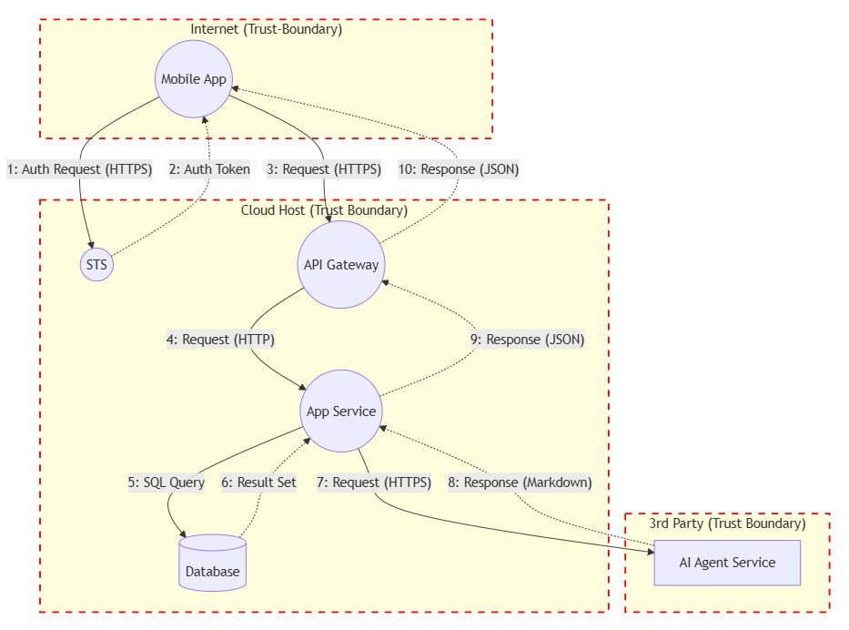
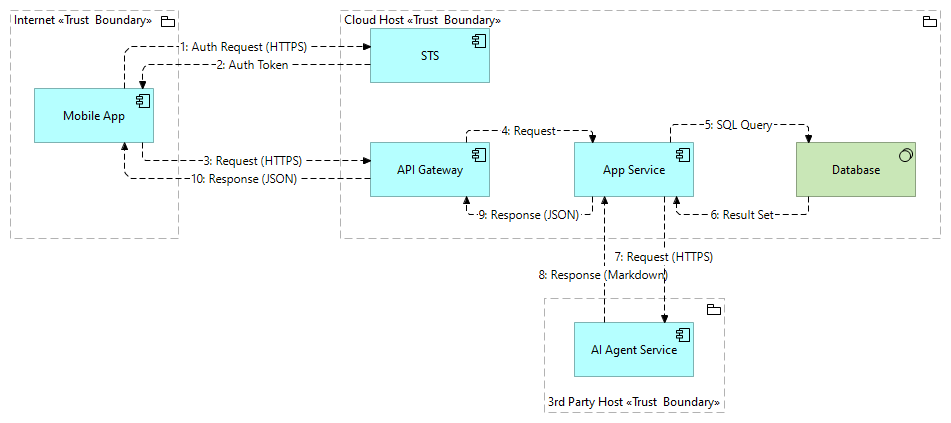

# AI-Assisted Threat Modelling

This project includes prompts, instructions and templates to assist software developers, software architects, and security experts to perform [threat modelling](https://en.wikipedia.org/wiki/Threat_model) exercises with assistance from an AI agent. It's based on the [STRIDE](https://en.wikipedia.org/wiki/STRIDE_model) threat modelling methodology while incorporating considerations from security frameworks such as OWASP and NIST.

The generated threat model reports provide a great starting point for identifying and prioritising threats to software systems related to security, data privacy, and artificial intelligence. There are three report templates with increasing levels of detail; lite, standard (default) & extended.

> Note: the prompts and instructions are setup for Github Copilot in Agent mode, however they can be adapted for other coding environments

## Pre-Requisites

A semantically structured diagramming format is the best means of providing context to an AI agent, so that is can reliably reason about the elements, data flows and threat boundaries of a system.

A pre-requisite is to have a data-flow diagram in one of the following formats:
- [**Mermaid**](https://mermaid.js.org/) Data Flow Diagram
    - Mermaid diagrams are created with a structured text-based syntax, stored in Markdown format. 
    - If you're not sure how to create a Mermaid flow diagram, you can write a description of the system components and data flows in a text file and use the "/mermaid-flow-diagram-create" prompt to convert it to a Mermaid flow diagram format. See the "Demo-FromDescription" demo project for an example.
    - Flow diagrams are used so that data flows can be represented in both directions.
- [**ArchiMate**](https://www.opengroup.org/archimate-forum/archimate-overview) Data Flow Diagram
    - This option is only recommended if you're already familiar with ArchiMate and using a tool such as [Archi](https://www.archimatetool.com/).
    - A dataflow diagram can be created using Application Conponents, Flow relationships, and Groupings (for trust boundaries).
    - The [ArchiScribe MCP Server](https://github.com/dclnbrght/archiscribe-mcp) can be used with an AI agent to retrieve information directly from an ArchiMate model.

## Create a New Threat Modelling Project

1. Create a new folder within the `projects` folder, with your {PROJECT_NAME}
2. Run the approprate prompt for your diagram format:
    - **Mermaid**
        - save the Mermaid flow diagram (as a `.md` file) to the resources folder: /projects/{PROJECT_NAME}/resources/
        - run the `/threat-modelling.mermaid` prompt in your AI coding agent, providing your {PROJECT_NAME} and optionally the report type { lite | standard(default) | extended } i.e.
            - */threat-modelling.mermaid project: {PROJECT_NAME}, report template: lite*
    - **ArchiMate**
        - setup and start the [ArchiScribe MCP Server](https://github.com/dclnbrght/archiscribe-mcp)
        - run the `/threat-modelling.archiscribe` prompt in your AI coding agent, providing your {PROJECT_NAME} and the ArchiMate viewname i.e.
            - */threat-modelling.archiscribe project: {PROJECT_NAME}, viewname: dataflow-view*
3. Review the generated report, making appropriate corrections and adjustments
4. While beyond the scope of this project, you can request an AI agent to creates work items (i.e. in Jira via MCP) based on the Mitigations section of the threat model report. 

---

## Demo Projects

The following demo projects are included with example resources and threat modelling reports:

### Demo-Description

The starting point for this project was a [text based description](/projects/Demo-FromDescription/resources/threat-model-dataflow-description.txt) of the system components, data flows and threat boundaries. (You can think of threat boundaries at different network segments.) The `/mermaid-flow-diagram-create.prompt` was used to generate the [threat-model-dataflow-mermaid.md](/projects/Demo-FromDescription/resources/threat-model-dataflow-mermaid.md) Mermaid diagram from this description.

The threat modelling report was generated based on the generated Mermaid diagram. 

The `lite` report template was used in this project: [report](projects\Demo-FromDescription\threat-model-Demo-FromDescription-20250928-lite.md)

### Demo-Mermaid

The starting point for this project was an existing Mermaid flow diagram:  [threat-model-dataflow-mermaid.md](/projects/Demo-FromMermaid/resources/threat-model-dataflow-mermaid.md)

The `standard` report template was used in this project: [report](projects\Demo-FromMermaid\threat-model-Demo-FromMermaid-20250928-standard.md)

### Demo-Archiscribe

The starting point for this project was a data-flow diagram created in ArchiMate, the details of the view were retrieved via the [ArchiScribe MCP Server](https://github.com/dclnbrght/archiscribe-mcp). The response from the MCP server is included in the resources folder: [threat-model-dataflow-archiscribe.md](/projects/Demo-FromArchiscribe/resources/threat-model-dataflow-archiscribe.md)

The `extended` report template was used in this project: [report](projects\Demo-FromArchiScribe\threat-model-Demo-FromArchiScribe-20250928-extended.md)

## File Structure

- `.github/` - the AI agent instructions for performing threat modelling
- `.github/prompts` - the AI agent prompts for initiating a threat modelling exercise
- `templates/` - threat modelling report templates
- `projects/` - directory to store individual threat modelling projects
    - `{PROJECT_NAME}/`
        - `resources/{data-flow-diagram.md}`        # the data flow diagram to be analysed
        - `{PROJECT_NAME}-threat-model-report.md`   # the generated threat model report based on a template