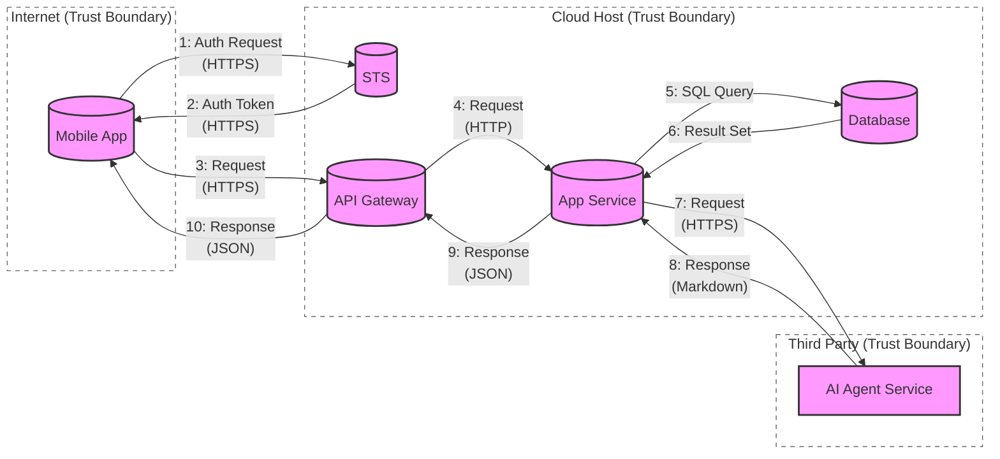

```mermaid
flowchart LR
    subgraph Internet["Internet (Trust Boundary)"]
        MobileApp[("Mobile App")]
    end

    subgraph CloudHost["Cloud Host (Trust Boundary)"]
        STS[("STS")]
        APIGateway[("API Gateway")]
        AppService[("App Service")]
        Database[("Database")]
    end

    subgraph ThirdParty["Third Party (Trust Boundary)"]
        AIService["AI Agent Service"]
    end

    %% Authentication Flow
    MobileApp -->|"1: Auth Request\n(HTTPS)"| STS
    STS -->|"2: Auth Token\n(HTTPS)"| MobileApp

    %% Main Request Flow
    MobileApp -->|"3: Request\n(HTTPS)"| APIGateway
    APIGateway -->|"4: Request\n(HTTP)"| AppService
    AppService -->|"5: SQL Query"| Database
    Database -->|"6: Result Set"| AppService

    %% AI Integration Flow
    AppService -->|"7: Request\n(HTTPS)"| AIService
    AIService -->|"8: Response\n(Markdown)"| AppService

    %% Response Flow
    AppService -->|"9: Response\n(JSON)"| APIGateway
    APIGateway -->|"10: Response\n(JSON)"| MobileApp

    %% Styling
    classDef boundary fill:none,stroke:#666,stroke-dasharray: 5 5;
    class Internet,CloudHost,ThirdParty boundary;
    
    classDef component fill:#f9f,stroke:#333,stroke-width:2px;
    class MobileApp,STS,APIGateway,AppService,Database,AIService component;
```
