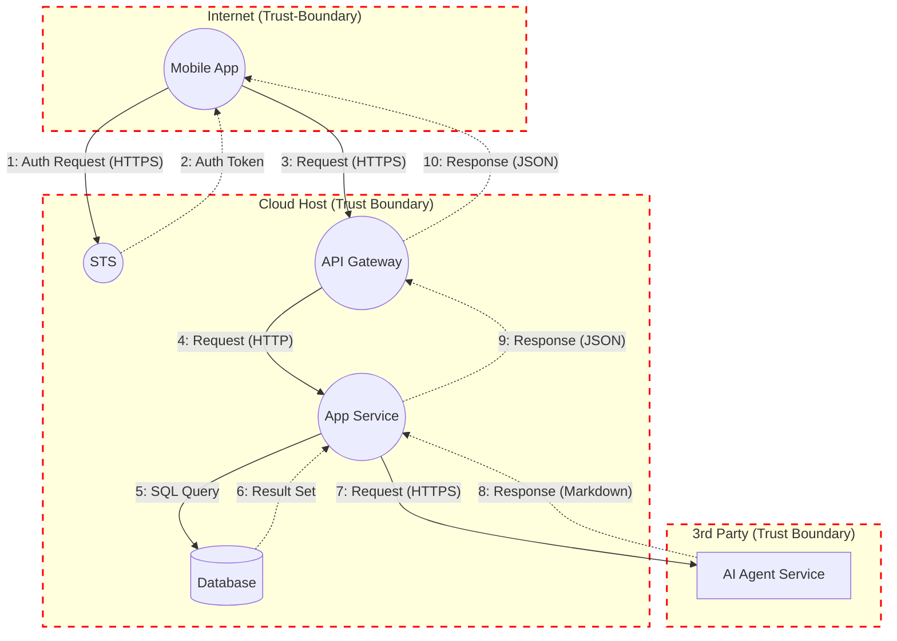

```mermaid

flowchart TD

    subgraph tb-internet["Internet (Trust-Boundary)"]
        client(("Mobile App"))
    end

    subgraph tb-cloud["Cloud Host (Trust Boundary)"]
        sts(("STS"))
        api-gateway(("API Gateway"))
        app-service(("App Service"))
        db[("Database")]
    end
    
    subgraph tb-thirdparty["3rd Party (Trust Boundary)"]
        ai-agent-service["AI Agent Service"]
    end

    client -- "1: Auth Request (HTTPS)" --> sts
    sts -. "2: Auth Token" .-> client
    client -- "3: Request (HTTPS)" --> api-gateway
    api-gateway -- "4: Request (HTTP)" --> app-service
    app-service -- "5: SQL Query" --> db
    db -. "6: Result Set" .-> app-service
    app-service -- "7: Request (HTTPS)" --> ai-agent-service
    ai-agent-service -. "8: Response (Markdown)" .-> app-service
    app-service -. "9: Response (JSON)" .-> api-gateway
    api-gateway -. "10: Response (JSON)" .-> client
 
    classDef css-tb stroke:#f00,stroke-width:2px,stroke-dasharray:8 8,white-space:nowrap
    class tb-internet,tb-cloud,tb-thirdparty css-tb

```
